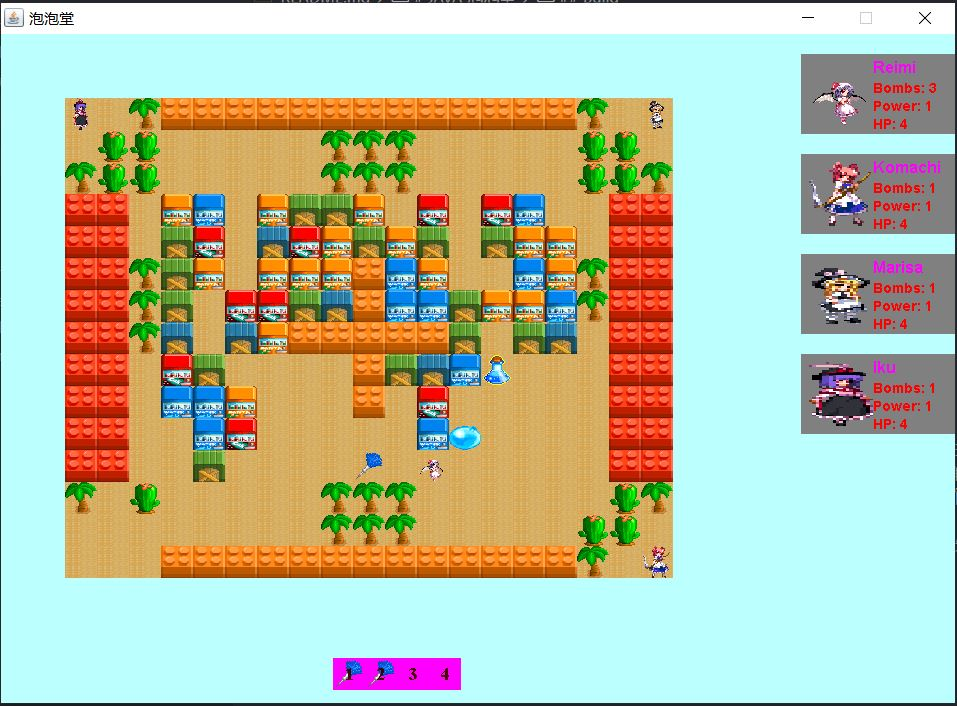

# Java 泡泡堂
早期选修Java的课程作业。上课期间我没有使用过IDE，一直是批处理编译打包，后来也没写过Java，因此仍是这样不使用IDE。

不熟悉Java的2D渲染，屏幕有闪烁问题。实现了帧动画，包括角色动态、弹跳的炸弹，冲击波动画等。
单人游戏，没写敌人AI，仅是Demo。

## Build
+ Require JDK Version 1.8
+ Require JNI
```
cd .\src
.\make_jar.bat
java -jar MyBnb.jar
```

## 游戏说明
+ Enter确定，ESC返回
+ 主页面↑↓方向键选择选项
+ 游戏操作
+ - WSAD移动
+ - Space 放置炸弹
+ - 炸毁建筑物掉落道具
+ - *  消耗性道具，被泡泡困住后可借此脱离
+ - *  同时可放置的炸弹数增加
+ - *  炸弹威力（爆炸范围）增加
+ - 1234数字键（不是小键盘）使用道具
+ - 被泡泡困住一定时间会失去一点HP，然后在出生点复活，清空增益；失去所有HP后游戏失败
+ - 右侧为状态面板，包含玩家信息、可用炸弹数量、威力、HP
+ - 下侧为道具面板，显示了可使用道具

## Screenshot

